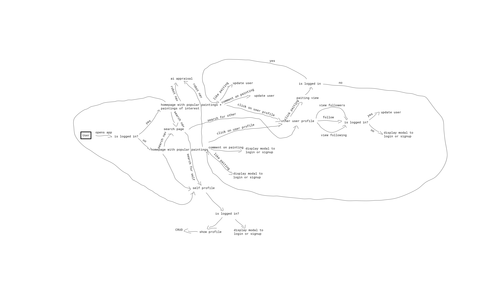
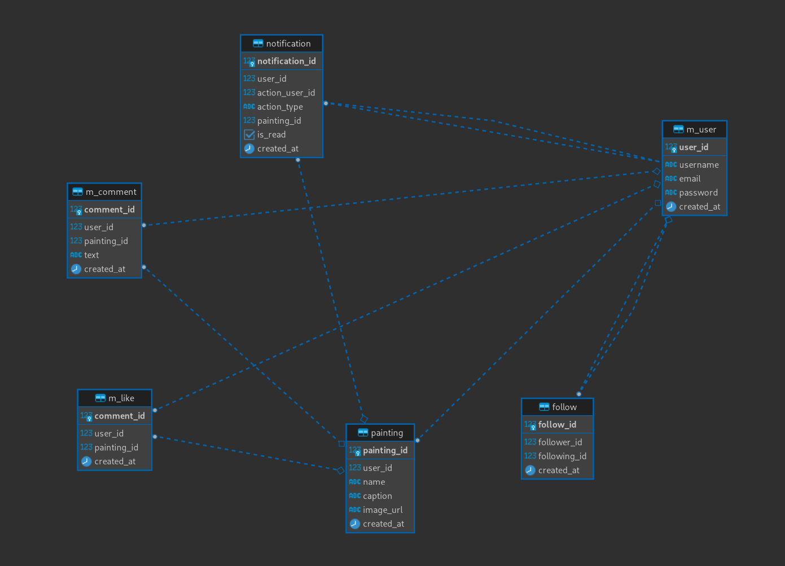

# Architecture

## Architecture Buzzwords

- Full stack
- Monorepo
- Microservice
- On the cloud

## Frontend

### Stack

Javascript, React Native, Expo

### Features

- Login
- Signup
- Homepage
- Profiles
- Upload (for sale) Painting
- Delete Painting
- Search for Users
- Evaluate Price of Painting based on Picture
- Buy Painting

### Interactions



### Design

// TODO

## Backend

### Stack

Typescript, Express, Python, Flask, Karas, PostgreSQL, Redis

### Database Design

[Database Schema](https://github.com/prince-ao/masterpiece/tree/main/backend/sql)



### Social API Design

#### User Authentication and Authorization

##### POST /api/auth/signup

```json
{
  "body": {
    "username": "string",
    "email": "string",
    "password": "string"
  }
}
```

`200` response:

```json
{
  "response": {
    "token": "string"
  }
}
```

`400` response:

```json
{
  "response": {
    "error_message": "string"
  }
}
```

---

##### POST /api/auth/login

_Note: username xor email_

```json
{
  "body": {
    "username": "string",
    "email": "string",
    "password": "string"
  }
}
```

`200` response:

```json
{
  "response": {
    "token": "string"
  }
}
```

`400` response:

```json
{
  "response": {
    "error_message": "string"
  }
}
```

---

---

#### Paintings Action

##### GET /api/paintings

```json
{
  "headers": {
    "Authorization": "Bearer <token>"
  }
}
```

`200` response:

```json
{
  "response": [
    {
      "image_url": "string"
    }
  ]
}
```

##### GET /api/paintings/user/[user_id]

`200` response:

```json
{
  "response": [
    {
      "image_url": "string"
    }
  ]
}
```

##### GET /api/paintings/[painting_id]

```json
{
  "headers": {
    "Authorization": "Bearer <token>"
  }
}
```

`200` response:

```json
{
  "response": {
    "image_url": "string",
    "name": "string",
    "price": "number",
    "ai_price": "number",
    "caption": "string"
  }
}
```

`400` response:

```json
{
  "response": {
    "error_message": "string"
  }
}
```

##### POST /api/paintings

_Note: the image is base64 encoded_

```json
{
  "headers": {
    "Authorization": "Bearer <token>"
  },
  "body": {
    "caption": "string",
    "name": "string",
    "image": "string",
    "price": "number"
  }
}
```

`200` response:

```json
{
  "response": {
    "image_url": "string"
  }
}
```

`400` response:

```json
{
  "response": {
    "error_message": "string"
  }
}
```

---

##### PATCH /api/paintings/[painting_id]

_Note: the body is caption or name_

```json
{
  "headers": {
    "Authorization": "Bearer <token>"
  },
  "body": {
    "caption": "string",
    "name": "string"
  }
}
```

`200` response:

`400` response:

```json
{
  "response": {
    "error_message": "string"
  }
}
```

---

##### DELETE /api/paintings/[painting_id]

```json
{
  "headers": {
    "Authorization": "Bearer <token>"
  }
}
```

`200` response:

`400` response:

```json
{
  "response": {
    "error_message": "string"
  }
}
```

---

---

#### Comment Action

##### POST /api/paintings/[painting_id]/comments

```json
{
  "headers": {
    "Authorization": "Bearer <token>"
  },
  "body": {
    "text": "string"
  }
}
```

`200` response:

`400` response:

```json
{
  "response": {
    "error_message": "string"
  }
}
```

---

##### PATCH /api/paintings/[painting_id]/comments/[comment_id]

```json
{
  "headers": {
    "Authorization": "Bearer <token>"
  },
  "body": {
    "text": "string"
  }
}
```

`200` response:

`400` response:

```json
{
  "response": {
    "error_message": "string"
  }
}
```

---

##### DELETE /api/paintings/[painting_id]/comments/[comment_id]

```json
{
  "headers": {
    "Authorization": "Bearer <token>"
  }
}
```

`200` response:

`400` response:

```json
{
  "response": {
    "error_message": "string"
  }
}
```

---

---

#### Like Action

##### POST /api/paintings/[painting_id]/like

```json
{
  "headers": {
    "Authorization": "Bearer <token>"
  }
}
```

`200` response:

`400` response:

```json
{
  "response": {
    "error_message": "string"
  }
}
```

---

##### DELETE /api/paintings/[painting_id]/like/[like_id]

```json
{
  "headers": {
    "Authorization": "Bearer <token>"
  }
}
```

`200` response:

`400` response:

```json
{
  "response": {
    "error_message": "string"
  }
}
```

---

---

#### Follow Action

##### GET /api/follow/[user_id]

```json
{
  "headers": {
    "Authorization": "Bearer <token>"
  }
}
```

`200` response:

`400` response:

```json
{
  "response": {
    "error_message": "string"
  }
}
```

##### POST /api/follow/[user_id]

```json
{
  "headers": {
    "Authorization": "Bearer <token>"
  }
}
```

`200` response:

`400` response:

```json
{
  "response": {
    "error_message": "string"
  }
}
```

---

---

##### DELETE /api/follow/[user_id]

```json
{
  "headers": {
    "Authorization": "Bearer <token>"
  }
}
```

`200` response:

`400` response:

```json
{
  "response": {
    "error_message": "string"
  }
}
```

---

---

#### Notification Action

##### GET /api/notifications

```json
{
  "headers": {
    "Authorization": "Bearer <token>"
  }
}
```

`200` response:

`400` response:

```json
{
  "response": {
    "error_message": "string"
  }
}
```

---

##### DELETE /api/notifications/[notifications_id]

```json
{
  "headers": {
    "Authorization": "Bearer <token>"
  }
}
```

`200` response:

`400` response:

```json
{
  "response": {
    "error_message": "string"
  }
}
```

#### User Actions

##### GET /api/user/[user_id]

`200` response:

```json
{
  "username": "string",
  "bio": "string",
  "followers_count": "number",
  "following_count": "number",
  "posts_count": "number",
  "profile_image": "string"
}
```

`400` response:

```json
{
  "response": {
    "error_message": "string"
  }
}
```

---

##### GET /api/profile

```json
{
  "headers": {
    "Authorization": "Bearer <token>"
  }
}
```

`200` response:

```json
{
  "username": "string",
  "bio": "string",
  "followers_count": "number",
  "following_count": "number",
  "painting_count": "number",
  "profile_image": "string"
}
```

`400` response:

```json
{
  "response": {
    "error_message": "string"
  }
}
```

---

---

#### Search Actions

##### GET /api/search?s=[search_string]

```json
{
  "headers": {
    "Authorization": "Bearer <token>"
  }
}
```

`200` response:

```json
[
  {
    "username": "string",
    "user_id": "number"
  }
]
```

`400` response:

```json
{
  "response": {
    "error_message": "string"
  }
}
```

---

---

#### Homepage Actions

##### GET /api/homepage?page=[page_number]

_Note auth is optional_

```json
{
  "headers": {
    "Authorization": "Bearer <token>"
  }
}
```

`200` response:

```json
{
  "data": [
    {
      "image_url": "string",
      "name": "string",
      "user_id": "string",
      "username": "string",
      "profile_image_url": "string",
      "caption": "string",
      "price": "number",
      "ai_price": "number",
      "likes": "number"
    }
  ],
  "hasNext": "boolean"
}
```

`400` response:

```json
{
  "response": {
    "error_message": "string"
  }
}
```

### AI API Design

#### Patina Model

##### POST /patina

_Note: the image is base64 encoded_

```json
{
  "body": {
    "image": "string"
  }
}
```

`200` response:

```json
{
  "price": "number"
}
```

`400` response:

```json
{
  "response": {
    "error_message": "string"
  }
}
```

##### PUT /patina

```json
{
  "Content-Type": "multipart/form-data",
  "body": {
    "image": "[image data]",
    "price": "number"
  }
}
```

`200` response:

`400` response:

```json
{
  "response": {
    "error_message": "string"
  }
}
```
